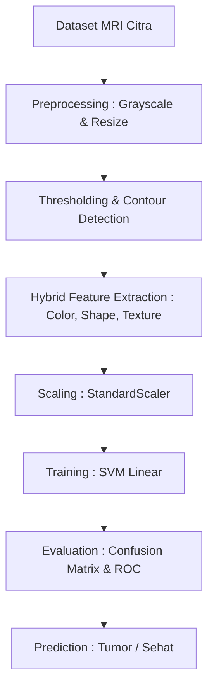

# 🧠 Brain Tumor MRI Classification

### Support Vector Machine (SVM) - Hybrid Feature Extraction

---

## 🚀 Project Overview

Proyek ini bertujuan untuk melakukan **klasifikasi otomatis tumor otak** dari citra MRI menggunakan algoritma **Support Vector Machine (SVM)**
Sistem ini mengandalkan pendekatan **Hybrid Feature Extraction** yang menggabungkan parameter intensitas , morfologi , dan tekstur untuk membedakan antara :

- 🔴 Tumor ( Yes )
- 🟢 Sehat ( No )

💡 _Pendekatan ini membuktikan efektivitas rekayasa fitur dalam pengolahan citra medis tanpa bergantung pada arsitektur Deep Learning yang kompleks_

---

## 🧠 Key Highlights

- ⚡ Akurasi Model : **76.47%** ( Hasil realistis tanpa _Skull Stripping_ )
- 📊 Ekstraksi **7 Fitur Hybrid** ( Warna , Bentuk , dan Tekstur )
- 🤖 Klasifikasi optimal menggunakan **Kernel Linear**
- 📉 Performa tangguh dengan skor **AUC 0.83**
- 🏥 Diimplementasikan khusus untuk domain **Computer Vision Medis**

---

## 🔗 Important Links

- 📂 Dataset ( Raw ) : https://www.kaggle.com/navoneel/brain-mri-images-for-brain-tumor-detection
- 🐍 Google Colab : https://colab.research.google.com/drive/1PAktKJK97mGKovkrRr5OlIpIfnPeT_2m?usp=sharing

---

## ⚙️ Methodology

### 1. Hybrid Feature Extraction

Sistem mengekstraksi tiga jenis fitur sekaligus untuk mendapatkan deskripsi citra yang komprehensif :

- **Fitur Warna ( Intensitas )** : Rata-rata kecerahan ( Mean ) dan standar deviasi piksel
- **Fitur Bentuk ( Morfologi )** : Luas area massa ( Area ) dan keliling luar objek ( Perimeter )
- **Fitur Tekstur ( GLCM )** : Contrast , Energy , dan Homogeneity

---

### 2. Preprocessing & Scaling

- Konversi citra ke **Grayscale** dan standardisasi resolusi ke **256x256** piksel
- Penyeimbangan kontribusi fitur menggunakan **StandardScaler** untuk mencegah bias dominasi nilai Area terhadap fitur Energy

---

### 3. Model Training

- **Algoritma** : Support Vector Machine ( SVM )
- **Kernel** : Linear
- **Alasan** : Sangat efektif dalam mencari _hyperplane_ pemisah pada dataset medis berdimensi menengah dengan fitur yang padat

---

## 📊 Results & Evaluation

### ✅ Model Performance

- **Akurasi : 76.47%**
- **ROC AUC Score : 0.83**
- Ukuran Data : **253 citra MRI** ( 155 Tumor , 98 Sehat )

### 🎯 Feature Engineering Insight

- Penambahan fitur morfologi sangat membantu model dalam membedakan massa tumor dari jaringan otak normal
- Feature scaling menjadi langkah wajib karena adanya ketimpangan rentang nilai yang signifikan antar kategori fitur

---

## 🛠️ Tech Stack

- **Python 3** [cite : 794]
- **OpenCV & Scikit-Image** ( Image Processing & Feature Extraction )
- **Scikit-Learn** ( Machine Learning & Evaluation )
- **Matplotlib & Seaborn** ( Data Visualization )

---

## 📈 Workflow

